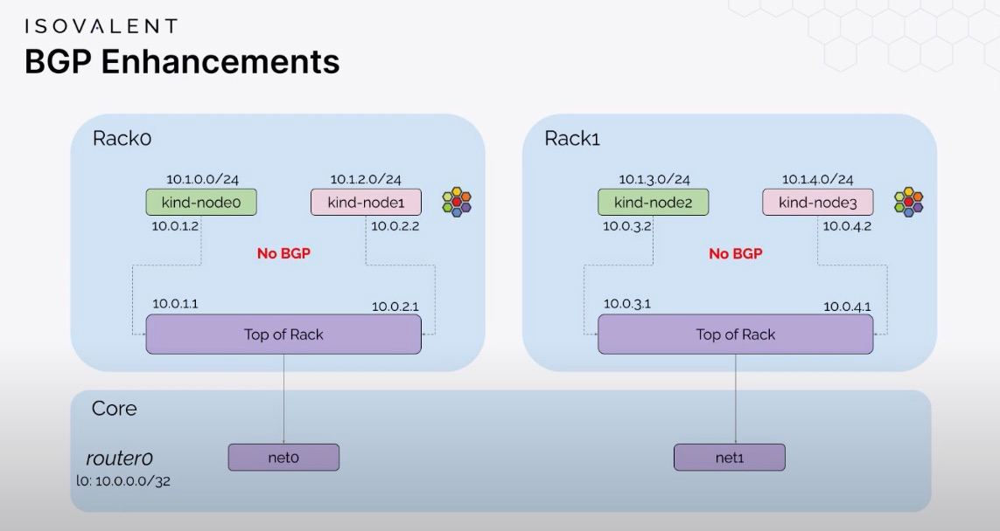

### Lab Cilium BGP
> copied from https://github.com/pyaillet/lab-cilium-bgp with changes to suit my needs.

A simple reproduction of the lab presented [here](https://www.youtube.com/watch?v=AXTKS0WCXjE) to be able to test some complementary things.

### Pre-requisites

You should have the following tools installed (make sure to also check their pre-requisites):
- [docker](https://docs.docker.com/engine/install/)
- [containerlab](https://containerlab.dev/install/)
- [kind](https://kind.sigs.k8s.io/docs/user/quick-start/#installation)
- [cilium-cli](https://docs.cilium.io/en/stable/gettingstarted/k8s-install-default/#install-the-cilium-cli)

You maybe already have all the pre-reqs, execpt for containerlab. This one is easy to install if you are in de Debian derivative.

```shell
echo "deb [trusted=yes] https://netdevops.fury.site/apt/ /" | \
sudo tee -a /etc/apt/sources.list.d/netdevops.list

sudo apt update && sudo apt install containerlab
```

For more installation steps on other platforms [containerlab/install](https://containerlab.dev/install/)

### How to use

All the steps are described in the `Makefile`, just type `make` to initialize the lab.

When you're done, use `make clean` to remove the lab.
> This lab can run totally separate from the other labs, if your machine have the resources, the labs can be running at the same time.

### the network looks like this.



### What now?

Now you can deploy an application and test your announcement, by default de PodCIDR will be announce to Tor(0 and 1).

[Cilium Star War](https://github.com/cilium/star-wars-demo)

