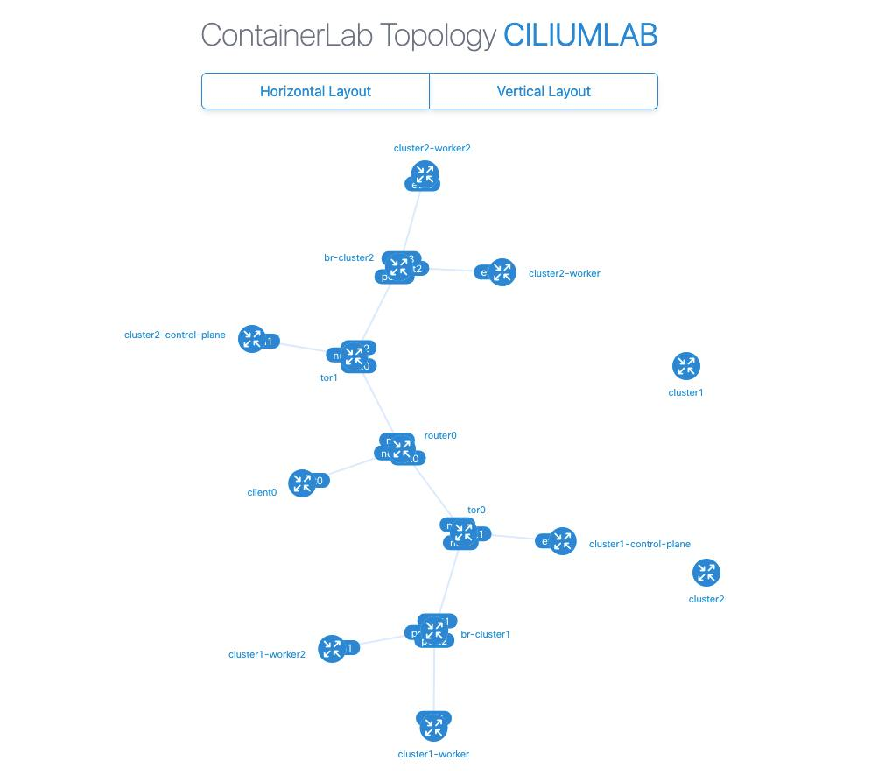

### Lab Cilium Mesh

A lab for Cilium Mesh networking, with this code you will be able to spin-up two cluster connected to two different routers that simulate different networks where you will build a Mesh and from client0 test that everything works (or not?).

### LAB Topology
> This is the network topology for the lab, the routers are simulating different networks and there is a bridge for each cluster where the worker nodes are connected to.




### Pre-requisites

You should have the following tools installed (make sure to also check their pre-requisites):
- [docker](https://docs.docker.com/engine/install/)
- [containerlab](https://containerlab.dev/install/)
- [kind](https://kind.sigs.k8s.io/docs/user/quick-start/#installation)
- [cilium-cli](https://docs.cilium.io/en/stable/gettingstarted/k8s-install-default/#install-the-cilium-cli)

You maybe already have all the pre-reqs, execpt for containerlab. This one is easy to install if you are in de Debian derivative.

```shell
echo "deb [trusted=yes] https://netdevops.fury.site/apt/ /" | \
sudo tee -a /etc/apt/sources.list.d/netdevops.list

sudo apt update && sudo apt install containerlab
```
> Please run the command 'sudo usermod -aG clab_admins <insert your username here> && newgrp clab_admins' to ensure that you are part of the Container admin group. You can check this by running 'groups'.

For more installation steps on other platforms [containerlab/install](https://containerlab.dev/install/)


### How to start the clusters and routers.

All the steps are described in the `Makefile`, just type `make` to get the list of targets available for the lab creation.

Just run `make init` to start the lab.


> This lab can be run separate from the other labs, if your machine have the resources, the labs can be running at the same time.

When you're done using the LAB, do a `make clean` to remove everything.

### What you can do with this LAB.

 In this lab you will be able to get familiar with the Cilium configurations needed to connect multiple Kubernetes clusters together in a Mesh.

 > Cilium installation can be made using make or you can do it manually if this is the first time.
 > using make 

 ```shell
 make cilium-install-cluster1
 make cilium-install-cluster2
```
or

```shell
	kubectl config use-context kind-cluster1
	cilium install --version=1.18 \
	  --helm-set cluster.name=cluster1 \
	  --helm-set cluster.id=1 \
	  --helm-set ipam.mode=multi-pool \
	  --helm-set tunnel-protocol=vxlan \
	  --helm-set ipv4NativeRoutingCIDR="10.0.0.0/8" \
	  --helm-set bgpControlPlane.enabled=true \
	  --helm-set k8s.requireIPv4PodCIDR=true
```
 > Change the context to cluster2, Name and id, now you can run the same command targeting cluster2.
 > if you look closelly to the cilium install, there is a name and also an ID, since this clusters will talk to each other, the Name and the ID has to be different.

Before enabling Cilium Mesh, lets apply some BGP configuration to be able to use LoadBalancer service for the Mesh endpoints, if you played with the BGP Labs, this is the same.

```shell
kubectl config use-context kind-cluster1
kubectl apply -f cluster1-bgp-config.yaml
kubectl apply -f cluster1-public-pool.yaml

kubectl config use-context kind-cluster2
kubectl apply -f cluster2-bgp-config.yaml
kubectl apply -f cluster2-public-pool.yaml
```

Now we need to enable the Cilium Mesh functionality.

```shell
cilium clustermesh enable --context kind-cluster1 --enable-kvstoremesh=false --service-type LoadBalancer
cilium clustermesh enable --context kind-cluster2 --enable-kvstoremesh=false --service-type LoadBalancer
```
Check for Mesh status in Cilium
```shell
cilium clustermesh status --context kind-cluster1 --wait 
cilium clustermesh status --context kind-cluster2 --wait 
```
> In some cases, the service type cannot be automatically detected and you need to specify it manually. This can be done with the option --service-type
> LoadBalancer:
> A Kubernetes service of type LoadBalancer is used to expose the control plane. This uses a stable LoadBalancer IP and is typically the best option.
> note: Remenber that LoadBalancer is not available unless configure, you can use part of the bgp lab.


### Check for networking and BGP status

After applying the BGP configuration, you can check for the status of the BGP instances and advertisements.

```shell
kubectl config use-context kind-cluster1
cilium bgp peers
```

```shell
kubectl config use-context kind-cluster2
cilium bgp peers
```

Take a look at the FRR BGP sessions.

```shell
docker exec -it clab-ciliumlab-router0 vtysh -c 'show bgp sum'
docker exec -it clab-ciliumlab-tor0 vtysh -c 'show bgp sum'
docker exec -it clab-ciliumlab-tor1 vtysh -c 'show bgp sum'
```

> Look for something like this:

```shell
debian@kind:~/ciliumlabs/mesh$ docker exec -it clab-ciliumlab-router0 vtysh -c 'show bgp sum'

IPv4 Unicast Summary (VRF default):
BGP router identifier 10.0.0.0, local AS number 65000 vrf-id 0
BGP table version 8
RIB entries 15, using 2760 bytes of memory
Peers 2, using 1433 KiB of memory
Peer groups 1, using 64 bytes of memory

Neighbor        V         AS   MsgRcvd   MsgSent   TblVer  InQ OutQ  Up/Down State/PfxRcd   PfxSnt Desc
tor0(net0)      4      65010      1689      1690        0    0    0 01:23:59            3        9 N/A
tor1(net1)      4      65011      1690      1691        0    0    0 01:23:59            3        9 N/A

Total number of neighbors 2
debian@kind:~/ciliumlabs/mesh$
```

### Connect the clusters

Finally, connect the clusters. This step only needs to be done in one direction. The connection will automatically be established in both directions:
```shell
cilium clustermesh connect --context kind-cluster1 --destination-context kind-cluster2
```
It may take a bit for the clusters to be connected. You can run cilium clustermesh status --wait to wait for the connection to be successful:
```shell
cilium clustermesh status --context kind-cluster1 --wait
```

Testing pod connectivity between clusters.

```shell
cilium connectivity test --context kind-cluster1 --multi-cluster kind-cluster2
```

> All this was taken from Cilium Docs [Great documentation!](https://docs.cilium.io/en/stable/network/clustermesh/clustermesh/)


### Installing an application and making it available from both clusters.

Thankfully, Cillium provides an example for this, you can find it [here](https://github.com/cilium/cilium/tree/main/examples/kubernetes/clustermesh)

In there we have a few YAML files that will let us deploy a test-app in our mesh.

```shell
kubectl config use-context kind-cluster1
kubectl apply -f https://raw.githubusercontent.com/cilium/cilium/refs/heads/main/examples/kubernetes/clustermesh/cluster1.yaml

kubectl config use-context kind-cluster2
kubectl apply -f https://raw.githubusercontent.com/cilium/cilium/refs/heads/main/examples/kubernetes/clustermesh/cluster2.yaml
```


### Aditional information

If the configuration that you want to test is not available in this lab, you can create new escenarios using the Cilium contrib lab [here](https://github.com/cilium/cilium/tree/main/contrib/containerlab/bgpv2)


